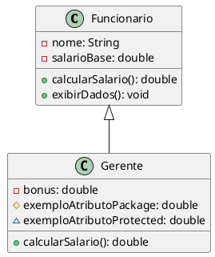
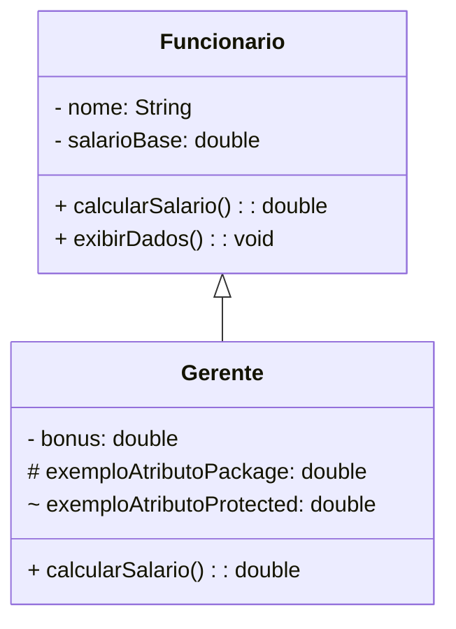

# 4. Diagrama de Classes

## PlantUML

```plantuml
@startuml
class Funcionario {
    - nome: String
    - salarioBase: double
    + calcularSalario(): double
    + exibirDados(): void
}
class Gerente {
    - bonus: double
    # exemploAtributoPackage: double
    ~ exemploAtributoProtected: double
    + calcularSalario(): double
}

Funcionario <|-- Gerente

@enduml

```

## Mermaid

```mermaid
classDiagram
    class Funcionario {
        - nome: String
         - salarioBase: double
        + calcularSalario(): double
        + exibirDados(): void
    }
    class Gerente {
        - bonus: double
        # exemploAtributoPackage: double
        ~ exemploAtributoProtected: double
        + calcularSalario(): double
    }
    Funcionario <|-- Gerente
```
